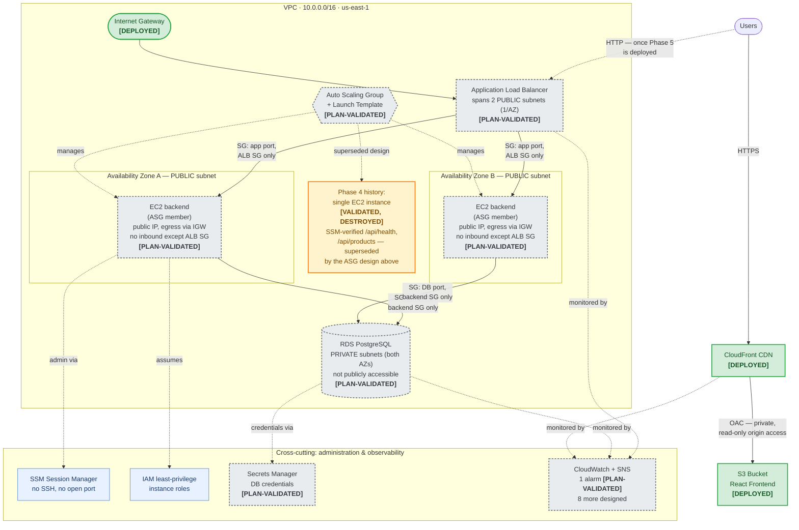

# CloudMart

CloudMart is a small e-commerce app used as the vehicle for a full, production-style AWS architecture — built with Terraform while preparing for the AWS Certified Solutions Architect – Associate (SAA-C03) exam. The application itself is intentionally simple; the point is the infrastructure: multi-AZ networking, a load-balanced/auto-scaled compute tier, a private relational database, a CDN-fronted static frontend, and the security, cost, and operational reasoning behind every one of those choices — documented well enough to defend in an interview, not just built to pass a lint check.

## Live Demo

**[https://d3u41r8pyeqew9.cloudfront.net](https://d3u41r8pyeqew9.cloudfront.net)** — the React frontend, served from a private S3 bucket through CloudFront (HTTPS, edge-cached, SPA routing supported).

The backend API (Phase 5) is intentionally not deployed — see [Cost Optimization](#cost-optimization) below. Instead of an error, the frontend falls back to a static copy of the product catalog bundled into the build (the same `backend/src/data/products.js` file the API serves, not a duplicate) and shows a small **"Demo mode"** banner saying so. The page itself, its routing, and its HTTPS/caching behavior are all live and real; the product data is static until the API tier is deployed. In local development (`npm run dev`) with the backend running, the frontend uses the real API and the banner doesn't appear.

> The demo-mode fallback takes effect on the next frontend deploy (build → `aws s3 sync` → CloudFront invalidation, see [docs/deployment.md](docs/deployment.md)). Until then, the live site still shows the older "Couldn't reach the CloudMart API" message.

## Architecture



Status is shown as an explicit label on every node (`[DEPLOYED]` / `[PLAN-VALIDATED]` / `[VALIDATED, DESTROYED]`), not by color alone. Source: [diagrams/cloudmart-architecture.mmd](diagrams/cloudmart-architecture.mmd); rendered PNG: [diagrams/cloudmart-architecture.png](diagrams/cloudmart-architecture.png).

## Architecture Highlights

- **Multi-AZ networking** — one VPC spanning two Availability Zones from the start, public and private subnets in each, so nothing had to be redesigned when compute and data tiers were added later.
- **Public/private subnet separation, with an honest cost trade-off** — the database is designed for private subnets with no route to the internet. The backend EC2 instances are designed for the *public* subnets (alongside the ALB), because the VPC deliberately has no NAT Gateway (~$32+/month each) and the instances need outbound internet for `npm install`, `git clone`, and SSM. They get a public IP but accept **no inbound traffic except the app port from the ALB's security group** — no SSH, no CIDR-based rule. Moving them into the private subnets behind a NAT Gateway (or VPC endpoints) is the documented production upgrade — see [ADR 0007](docs/decisions/0007-phase5-alb-asg-plan-not-deployed.md).
- **S3 + CloudFront frontend** — the React build lives in a fully private S3 bucket; CloudFront is the only reader, via Origin Access Control, and is the only public entry point for static content.
- **ALB + Auto Scaling production design** — a load balancer and Auto Scaling Group across both AZs, with ELB-based health checks so a failed instance is detected and replaced automatically, no manual intervention.
- **Private RDS tier** — PostgreSQL with no public accessibility, reachable only from the backend's security group, encrypted at rest, with a master password AWS generates and manages via Secrets Manager (never handled directly, never in Terraform state).
- **SSM instead of SSH** — no key pairs, no open port 22, anywhere in this project. Administrative access is IAM-gated through AWS Systems Manager Session Manager.
- **Least-privilege IAM** — service roles scoped to exactly the permissions they need (e.g. the backend's role can read exactly one Secrets Manager secret, nothing broader); the human operator's own SSO permission set was deliberately *not* widened when it blocked an early apply — a narrowly-scoped policy was added instead.
- **Terraform IaC, 100%** — every resource, across every phase (deployed or not), is defined in Terraform. No manual console changes to anything long-lived.
- **Cost-aware deployment decisions** — every resource with a real ongoing charge was either time-boxed and destroyed after validation, or left fully designed and `plan`-verified but never applied, pending explicit approval. See [Cost Optimization](#cost-optimization).

## Implementation Status

| Component | Status | Notes |
|---|---|---|
| VPC, 2 AZs, public/private subnets, IGW, route tables | ✅ **Deployed** | Standing infrastructure, $0/month (free resource types) |
| S3 (private) + CloudFront + OAC + HTTPS + SPA routing | ✅ **Deployed** | Live frontend, usage-based cost, no idle charge |
| Single EC2 backend + SSM + IAM role (no SSH, no public port 4000) | 🟠 **Validated, then destroyed** | Verified `/api/health` and `/api/products` over an SSM tunnel, then torn down for cost control; superseded by the ASG design below |
| Application Load Balancer + Target Group | 🟡 **Plan-validated only** | `terraform plan` confirms correctness; never applied |
| Auto Scaling Group + Launch Template (multi-AZ EC2) | 🟡 **Plan-validated only** | Instances in the public subnets (no NAT Gateway); backend security group accepts the app port only from the ALB's security group |
| RDS PostgreSQL (private subnets, encrypted, Secrets Manager) | 🟡 **Plan-validated only** | Single-AZ by default; Multi-AZ is a documented, one-variable upgrade |
| CloudWatch monitoring + SNS | 🟡 **Mostly plan-validated** | 1 alarm (CloudFront 5xx) is `plan`-verified and ready to deploy at ~$0/month; 8 more (ALB/ASG/RDS) are designed but inert |

## AWS Services

VPC · Subnets · Internet Gateway · Route Tables · Security Groups · EC2 · Application Load Balancer · Auto Scaling Groups · Launch Templates · RDS (PostgreSQL) · Secrets Manager · S3 · CloudFront · Origin Access Control · IAM (roles + IAM Identity Center/SSO) · Systems Manager (Session Manager) · CloudWatch · SNS

## Security

- **Private S3 + OAC**: the frontend bucket has all four S3 Block Public Access settings enabled; the only reader is CloudFront, via Origin Access Control, scoped to this exact distribution's ARN — not "any CloudFront distribution."
- **HTTPS on everything that's live**: CloudFront enforces `redirect-to-https` on every viewer connection today. The plan-validated ALB design has only an **HTTP :80 listener** — an HTTPS listener needs an ACM certificate, which needs a custom domain this project doesn't have. Adding a custom domain, an ACM certificate, and an HTTPS :443 listener (with HTTP redirected to it) is a listed production upgrade, not something this design does today.
- **SSM instead of SSH**: no key pairs, no port 22, anywhere in this project — IAM-gated shell/tunnel access only.
- **Security-group chaining**: ALB → backend → database, each hop trusting the *previous security group by reference*, never a CIDR block — so the rule stays correct automatically as instances are replaced. This is also what keeps the public-subnet backend instances unreachable from the internet: their only inbound rule is the app port from the ALB's security group.
- **Private RDS**: `publicly_accessible = false`, reachable only from the backend's security group, and the database's own security group has zero egress rules (it never needs to initiate outbound connections).
- **Encryption at rest**: S3 (SSE-S3) and the RDS design (`storage_encrypted = true`, which can only be set at creation, not retrofitted).
- **Secrets Manager design**: the RDS master password is generated and owned entirely by AWS (`manage_master_user_password = true`) — it never appears in Terraform code, state, or this repo.
- **IAM Identity Center / temporary credentials**: all administrative access (including Terraform itself) uses IAM Identity Center SSO — short-lived, auto-expiring credentials, never a long-lived access key.

Full detail, including a production-hardening checklist (what a real production deployment would add beyond this project): [docs/security.md](docs/security.md).

## Availability & Scalability

- **2-AZ design** from the very first infrastructure phase, before there was anything to put in the second AZ — nothing had to be redesigned later.
- **ALB** distributes traffic across both AZs and decouples clients from any individual instance's identity.
- **ASG** maintains a fixed desired capacity (2, one per AZ) and replaces failed instances automatically.
- **Health checks**: the target group polls the app's own `/api/health` endpoint; the ASG reacts to *that* result (`health_check_type = "ELB"`), not just basic EC2 status — so an OS that's fine but a crashed app process still gets detected and replaced.
- **Replacement behavior**: a failed instance is detected within ~60-90 seconds, removed from rotation immediately, and a replacement is launched from the same Launch Template with no manual step.
- **RDS Multi-AZ** is a documented, one-variable production option (`var.db_multi_az`) — synchronous standby, automatic failover in ~60-120 seconds — deliberately not enabled by default given this project's traffic (none) and cost priorities.

Full failure-scenario and RTO/RPO analysis: [docs/architecture.md](docs/architecture.md#reliability).

## Cost Optimization

- **No NAT Gateway, anywhere in this project's Terraform** — it has a real hourly charge (~$32+/month per gateway). The trade-off: the backend instance design sits in the public subnets and uses its own public IP for outbound traffic (locked down to ALB-only inbound), and only the database, which never needs outbound internet, uses the private subnets.
- **The Phase 4 EC2 validation was destroyed the same day it was proven** — deploy, verify, tear down is the deliberate pattern for anything with a real per-hour cost, not "leave it running to be safe."
- **ALB, ASG, and RDS remain plan-validated, not standing** — each is fully designed and `terraform plan`-verified (proving correctness without spending anything), but left undeployed because their combined cost if left running (~$48.57/month for Phase 5, ~$15.84-31.28/month for Phase 6) wasn't judged worth paying for a portfolio project with no real traffic.
- **S3 + CloudFront was chosen for the public demo specifically because it has no idle/base charge** — unlike EC2, ALB, RDS, and NAT Gateway, cost is 100% usage-based, so a live, always-on public demo link costs effectively $0/month at near-zero traffic.
- The current standing architecture is designed to stay **at or near $0/month with minimal traffic** — this is not a guarantee of a $0 bill forever; real traffic, a future custom domain, or deploying the plan-validated tiers would all add real, clearly-documented cost. See [docs/cost.md](docs/cost.md) for the full breakdown and every dollar figure behind these claims.

## Terraform

`infrastructure/terraform/environments/dev` wires together five modules — `vpc` and `static_site` are deployed; `compute` (Phase 5), `database` (Phase 6), and most of `monitoring` (Phase 8) are `plan`-validated only, in the *same* configuration.

> ⚠️ **A bare `terraform apply` in the `dev` environment may attempt to create intentionally undeployed Phase 5/6 resources.** Use the documented targeted workflow:
> ```bash
> terraform plan  -target=module.<name>
> terraform apply -target=module.<name>   # never -auto-approve
> ```
> See [docs/deployment.md](docs/deployment.md) and [docs/runbook.md](docs/runbook.md) for the exact commands per module.

## Repository Structure

```
cloudmart-aws/
├── frontend/                    # React + Vite SPA
├── backend/                     # Node.js/Express API
├── infrastructure/terraform/
│   ├── environments/dev/        # Root config — wires modules together
│   └── modules/                 # vpc, compute, database, static-site, monitoring
├── docs/                        # Architecture, security, cost, deployment, runbook, ADRs
├── diagrams/                    # Architecture diagram (Mermaid source + PNG)
└── README.md
```

## Key Architecture Decisions

Every significant decision has a short ADR — what was decided, why, and what alternatives were considered:

- [0001](docs/decisions/0001-use-terraform-for-infrastructure.md) — Terraform for IaC
- [0004](docs/decisions/0004-aws-authentication-via-iam-identity-center.md) — IAM Identity Center over access keys
- [0005](docs/decisions/0005-vpc-network-design.md) — VPC design, per-AZ private route tables
- [0006](docs/decisions/0006-ec2-compute-placement-and-access.md) — EC2 placement, SSM-only access
- [0007](docs/decisions/0007-phase5-alb-asg-plan-not-deployed.md) — ALB/ASG design, why not deployed
- [0008](docs/decisions/0008-phase6-rds-plan-not-deployed.md) — RDS design, why not deployed
- [0009](docs/decisions/0009-phase7-static-site-plan-not-deployed.md) — S3/CloudFront design (later deployed)
- [0010](docs/decisions/0010-phase8-operational-polish.md) — Monitoring scope + a real Terraform dependency-graph bug found and fixed

Full index: [docs/decisions/](docs/decisions/).

## What I Learned

- **IAM least privilege in practice, not just in theory** — hit `PowerUserAccess`'s intentional IAM-management restriction firsthand (a real anti-privilege-escalation guardrail), and resolved it with a narrowly-scoped, resource-name-restricted policy rather than reaching for a broader one.
- **Terraform dependency-graph behavior beyond the happy path** — discovered that referencing another module's output creates a dependency edge to that *entire* module, even for a currently-null value, and that `-target` can silently expand its own blast radius through that edge. Found and fixed during Phase 8; documented as a general lesson, not just a one-off patch.
- **Cost-aware architecture as a design constraint, not an afterthought** — every resource with a real hourly charge went through the same explicit lifecycle: designed, `plan`-verified, and either time-boxed-and-destroyed or left deliberately undeployed pending approval.
- **Terraform state management realities** — local state, targeted applies, stale outputs from resources removed out of config but never reconciled (fixed with a `-refresh-only` apply, which is provably incapable of touching real infrastructure) — the kind of operational detail that only shows up from actually running Terraform repeatedly, not from reading about it.
- **Secure instance administration without SSH** — SSM Session Manager end-to-end, including the operational discovery that its CLI plugin isn't bundled with the AWS CLI and needed a `sudo`-free manual install.
- **Production vs. portfolio trade-offs, named explicitly rather than hidden** — Single-AZ RDS, backend instances in public subnets instead of private-plus-NAT, no custom domain (so no HTTPS on the ALB), no CI/CD, local Terraform state: every one of these is a deliberate, documented choice for this project's scope and budget, with the production alternative written down alongside it, not glossed over.

## Running Locally

Two services, run separately (no Docker):

```bash
# Terminal 1 — backend (http://localhost:4000)
cd backend
cp .env.example .env
npm install
npm run dev

# Terminal 2 — frontend (http://localhost:5173)
cd frontend
cp .env.example .env
npm install
npm run dev
```

Then open `http://localhost:5173`. See [backend/README.md](backend/README.md) and [frontend/README.md](frontend/README.md) for details.

## Documentation

| Doc | Purpose |
|---|---|
| [docs/architecture.md](docs/architecture.md) | Living architecture overview, monitoring, reliability, RTO/RPO |
| [docs/networking.md](docs/networking.md) | VPC/subnet/route table layout, CIDR plan |
| [docs/security.md](docs/security.md) | IAM, network isolation, secrets, production-hardening checklist |
| [docs/cost.md](docs/cost.md) | Every cost figure behind the claims above, plus the full cost-controls table |
| [docs/deployment.md](docs/deployment.md) | How each phase was actually deployed, and how to redeploy/tear down |
| [docs/runbook.md](docs/runbook.md) | Day-to-day operational commands: verify, inspect, redeploy, destroy, troubleshoot |
| [docs/decisions/](docs/decisions/) | All ADRs |
| [docs/ROADMAP.md](docs/ROADMAP.md) | Full phase-by-phase build history, and what was deliberately not pursued further |

## License

MIT — see [LICENSE](LICENSE).

## Author

Terrence Freemane
